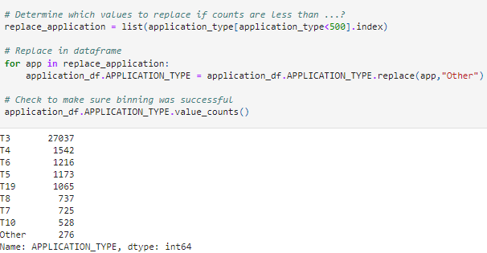

# Neural_Network_Charity_Analysis
Module 19 Challenge
## Overview

With my knowledge of machine learning and neural networks, I will help Beks by using the features in the charity dataset to create a binary classifier that is capable of predicting whether applicants will be successful if funded by Alphabet Soup.

Beks received a CSV containing more than 34,000 organizations from Alphabet Soup’s business team, that have received funding from Alphabet Soup over the years. Within this dataset are a number of columns that capture metadata about each organization.  These columns will be preprocessed and utilized to create a Neural Network model, train the model and test the model for accuracy.

## Purpose

The purpose of exercise is to use skills learned during the Neural Network module to create, train, test and optimize a Neural Network model.  To complete this activity, we will use Python, sklearn, tensorflow, and pandas.

### Deliverable 1: Preprocessing Data for a Neural Network Model

* Import the Charity Data CSV

* Columns that will be considered as features are a follows:

    * APPLICATION_TYPE—Alphabet Soup application type
    * AFFILIATION—Affiliated sector of industry
    * CLASSIFICATION—Government organization classification
    * USE_CASE—Use case for funding
    * ORGANIZATION—Organization type
    * STATUS—Active status
    * INCOME_AMT—Income classification
    * SPECIAL_CONSIDERATIONS—Special consideration for application
    * ASK_AMT—Funding amount requested

* Column that is considered target for the model:

    * IS_SUCCESSFUL—Was the money used effectively

* Columns that will be dropped as deemed not value added for this analysis:

    * EIN
    * NAME—Identification columns

* The columns with more than 10 unique values have been grouped together

* The categorical variables have been encoded using one-hot encoding

* Columns with greater than 10 values have been identified and "rare" categorical values have been grouped together in another column
* APPLICATION plotted and then grouped

* CLASSIFICATION plotted and then grouped

* The preprocessed data is split into features and target arrays
* * The preprocessed data is split into training and testing datasets

* The numerical values have been standardized using the StandardScaler() module

### Deliverable 2: Compile, Train, and Evaluate the Model

The neural network model using Tensorflow Keras contains working code that performs the following steps:

* The number of layers, the number of neurons per layer, and activation function are defined

* An output layer with an activation function is created

* There is an output for the structure of the model

* There is an output of the model’s loss and accuracy

* The model's weights are saved every 5 epochs

* The results are saved to an HDF5 file

### Deliverable 3: Optimize the Model

#### Optimization 1

#### Optimization 2

#### Optimization 3

### Deliverable 4: A Written Report on the Neural Network Model
