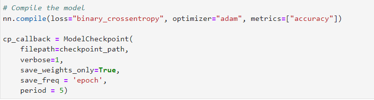

# Neural_Network_Charity_Analysis
Module 19 Challenge
## Overview

With my knowledge of machine learning and neural networks, I will help Beks by using the features in the charity dataset to create a binary classifier that can predict whether applicants will be successful if funded by Alphabet Soup.

Beks received a CSV containing more than 34,000 organizations from Alphabet Soup’s business team, that have received funding from Alphabet Soup over the years. Within this dataset there are several columns that capture metadata about each organization.  These columns will be preprocessed and utilized to create a Neural Network model, train the model, and test the model for accuracy.

## Purpose

The purpose of exercise is to use skills learned during the Neural Network module to create, train, test and optimize a Neural Network model.  To complete this activity, we will use Python, sklearn, tensorflow, and pandas.

### Deliverable 1: Preprocessing Data for a Neural Network Model

* The code belows import the Charity Data CSV

* From this dataset the columns that will be considered as features are as follows:

    * APPLICATION_TYPE—Alphabet Soup application type
    * AFFILIATION—Affiliated sector of industry
    * CLASSIFICATION—Government organization classification
    * USE_CASE—Use case for funding
    * ORGANIZATION—Organization type
    * STATUS—Active status
    * INCOME_AMT—Income classification
    * SPECIAL_CONSIDERATIONS—Special consideration for application
    * ASK_AMT—Funding amount requested

* Column that is considered target for the model:

    * IS_SUCCESSFUL—Was the money used effectively

* Columns that will be dropped as deemed not value added for this analysis:

    * EIN
    * NAME—Identification columns

* The code snippet below displays features with more than 10 unique values and have been grouped together

* Reviewing the snippet below, the categorical variables have been encoded using one-hot encoding

* Columns with greater than 10 values have been identified and "rare" categorical values have been grouped together in another column called "other"

* APPLICATION plotted and then grouped

* CLASSIFICATION plotted and then grouped

* The preprocessed data is split into features and target arrays and also slit into training and testing datasets using the code below:

* The snippet below displays the code used to standardized numerical values using the StandardScaler() module

### Deliverable 2: Compile, Train, and Evaluate the Model

The neural network model using Tensorflow Keras contains working code that highlights the following:

* The number of layers, the number of neurons per layer, and activation function are defined

* There is an output of the model’s loss and accuracy

* The model's weights are saved every 5 epochs

* The resulting output highlighting data structure and checkpoints

* The results are saved to an HDF5 file

### Deliverable 3: Optimize the Model

#### Optimization 1

Link to Optimization one notebook can be found here [Optimization_1](AlphabetSoupCharity_Optimization_1.ipynb)

The approach that I took for my first attempt to optimize the model was to try to reduce noise from the model and increase the epochs from 50 to 150.  To reduce "Noise" I dropped the "SPECIAL_CONSIDERATIONS" column and created code to create bins for the "ASK_AMT" to reduce the impact of outliers on the model. After running the model with these modifications, the results yielded very little improvement.

#### Optimization 2

Link to Optimization one notebook can be found here [Optimization_2](AlphabetSoupCharity_Optimization_2.ipynb)

The approach that I took for my second attempt to optimize the model was to keep the changes made for the first optimization which was meant to reduce noise from the model and increase the epochs.  To reduce "Noise" I dropped the "SPECIAL_CONSIDERATIONS" column and created code to create bins for the "ASK_AMT" to reduce the impact of outliers on the model. Then I added two additional layers and increased the Neurons of he original two hidden layers.  Finally, I increased Epochs from 100 to 150.  After running the model with these modifications, the results yielded very little improvement.

#### Optimization 3

Link to Optimization one notebook can be found here [Optimization_3](AlphabetSoupCharity_Optimization_3.ipynb)

For the third optimization attempt, I kept intact the changes made during the first two optimization attempts.  My approach to improve the optimization of this model was to try to find more possible noise contributors remove it. I also added Neurons to the existing hidden layers and changed the Activation on one of the layers.  To reduce the noise further, I dropped the USE_CASE and STATUS Features from the dataset and for the INCOME_AMT feature I grouped some of the lower frequency values and placed it in a "other" column.  Unfortunately, these changes did not yield the desired improvements.

### Summary

Very challenging assignment. I tried to tweak so many different features, neurons, layers, activations etc.  I spent a day and a half trying to figure out how to get the model to improve.  I definitely found ways to make the model worse but, nothing made it substantially better.  There were so many optimization attempts that were not saved in the submitted files.  I even tried an RandomForest model to see if it could yield better results. Definitely I would be interested in learning the right approach for this data set. 

On a side note, I am currently looking for opportunities to use skills learned in module 18 and 19 with my current employer.
